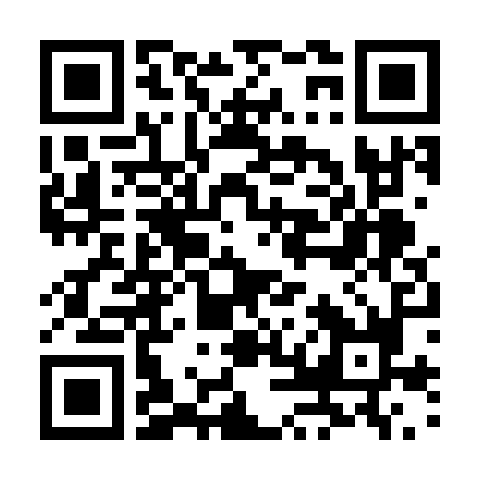

# 라즈베리파이와 SenseHAT으로 배우는 피지컬 컴퓨팅

초·중·고 교사 연수 자료입니다. (3차시 · 50분 × 3 = 150분)

- 강사: 오정훈 (부산동고등학교)
- 장비: Raspberry Pi 4B (8GB) + Argon One V2 케이스 + Sense HAT (V2)
- OS: Raspberry Pi OS Full (64-bit), 2026-09-15 (Debian 13 Trixie)
- 코드: **Python**과 **Scratch 3**를 나란히 비교

## 바로 보기

- **발표 슬라이드**: https://hermits-diner.github.io/sensehat-workshop/slides/
- 첫 화면 (슬라이드 · 교재 PDF · 예제 코드 모음): https://hermits-diner.github.io/sensehat-workshop/



휴대폰 카메라로 찍으면 슬라이드가 열립니다.

## 무엇이 있나요

| 폴더 | 내용 |
|---|---|
| [`pdf/`](pdf/) | **교사용 교재** `연수교재.pdf` (A4 가로, Python·Scratch 비교), `슬라이드원고.pdf` |
| [`slides/`](slides/) | **발표 슬라이드** `index.html` (62장 (부록: 추가 예제 12개 포함), 인터넷 없이 열림) |
| [`code/python/`](code/python/) | Python 예제 16개 (s00~s12 기초, p01~p03 프로젝트) |
| [`code/python/extra/`](code/python/extra/) | **추가 Python 예제 12개** (e01~e12, 아래 목록) |
| [`code/scratch/`](code/scratch/) | Scratch 3 예제 15개 (`.sb3`) |
| [`docs/`](docs/) | 교재 원고 (Markdown)와 캡처 그림 |
| [`tools/`](tools/) | 원고에서 코드·PDF·슬라이드를 만드는 스크립트 |

## 차시 구성

| 차시 | 주제 | 내용 |
|---|---|---|
| 1차시 | 시작하기 | OS 설치(Imager 2.0), 한글 설정, 라즈베리파이·SenseHAT 소개, 첫 코드 |
| 2차시 | 파이썬 기초 12단계 | 한 단계에 새 개념 1개: 명령 → 변수 → 색 → 좌표 → 순서 → for → 리스트 → 센서 → if → while → 조이스틱 → 함수 |
| 3차시 | 미니 프로젝트 | 기울이면 화살표 · 카멜레온(컬러 센서) · 전자 주사위, 학교급별 수업 적용 |

## 추가 예제 (Python)

기초 12단계를 마친 뒤 더 해 볼 수 있는 예제입니다. 모두 실제 SenseHAT에서 실행해 확인했습니다.

| 파일 | 내용 | 새로 나오는 것 |
|---|---|---|
| [e01_rainbow](code/python/extra/e01_rainbow.py) | 줄마다 다른 색으로 무지개 채우기 | 이중 `for`, 리스트 번호 |
| [e02_smiley](code/python/extra/e02_smiley.py) | 웃는 얼굴 그리기 | `set_pixels` (64칸 한 번에) |
| [e03_heart](code/python/extra/e03_heart.py) | 두근두근 하트 | 그림 두 개 번갈아 보여 주기 |
| [e04_countdown](code/python/extra/e04_countdown.py) | 5 → 1 → GO! | `range(5, 0, -1)` 거꾸로 세기 |
| [e05_humidity](code/python/extra/e05_humidity.py) | 습도에 따라 파랑·초록·주황 | `if / elif / else` |
| [e06_thermometer_bar](code/python/extra/e06_thermometer_bar.py) | 온도를 막대 높이로 | 계산, `max` / `min` |
| [e07_joystick_dot](code/python/extra/e07_joystick_dot.py) | 조이스틱으로 점 옮기기 | 위치 변수, `continue` |
| [e08_marble](code/python/extra/e08_marble.py) | 기울이는 쪽으로 구슬 굴리기 | 가속도 센서 |
| [e09_shake_dice](code/python/extra/e09_shake_dice.py) | 흔들면 주사위 | `abs`, `or` |
| [e10_reaction_game](code/python/extra/e10_reaction_game.py) | 초록불에 빨리 누르기 (ms 측정) | `time()`, `uniform` |
| [e11_data_logger](code/python/extra/e11_data_logger.py) | 온도·습도·기압을 CSV로 저장 | 파일 쓰기 (엑셀로 열림) |
| [e12_colour_name](code/python/extra/e12_colour_name.py) | 컬러 센서로 R·G·B 맞히기 (V2 전용) | `and` 조건 |

> e07·e08은 Argon 케이스에서 조이스틱·기울기 방향이 반대로 읽히는 것을 코드에 반영했습니다.

## 사용법

**슬라이드**: 웹에서 [바로 보기](https://hermits-diner.github.io/sensehat-workshop/slides/)로 열거나, 인터넷이 없을 때는 `slides` 폴더를 통째로 받아서 `index.html`을 브라우저로 엽니다.

| 키 | 동작 |
|---|---|
| → / Space | 다음 |
| ← | 이전 |
| F | 전체 화면 |
| N | 강사 메모 |

**예제 코드**: 라즈베리파이에서 Thonny로 `.py`를 열거나, Scratch 3에서 `.sb3`를 불러옵니다.

> Argon One V2 케이스에서는 SenseHAT이 거꾸로 꽂히므로, 모든 코드가 `sense.set_rotation(180)`으로 시작합니다.

## 자료 다시 만들기

원고(`docs/*.md`)를 고친 뒤 라즈베리파이에서 실행합니다.

```bash
python3 tools/make_code.py      # Python 예제
python3 tools/make_sb3.py       # Scratch 예제
python3 tools/build_pdf.py      # PDF (chromium 필요)
python3 tools/build_slides.py   # 슬라이드
```

## 출처

- `docs/images/web_*.png`(`slides/images/`에도 같은 파일)는 라즈베리파이 웹사이트를 캡처한 것입니다.
  - [raspberrypi.com](https://www.raspberrypi.com), [raspberrypi.org/teach](https://www.raspberrypi.org/teach/)
  - 저작권은 Raspberry Pi Ltd · Raspberry Pi Foundation에 있습니다.
- 가격 정보: 라즈베리파이 공식 발표 (2019.6, 2020.5, 2025.12, 2026.2, 2026.4)
- 슬라이드는 [scratchblocks](https://github.com/scratchblocks/scratchblocks)와 [qrcodejs](https://github.com/davidshimjs/qrcodejs)를 사용합니다.

> 교재 속 Wi‑Fi와 계정 비밀번호는 연수용입니다. 학교에서 쓸 때는 바꾸세요.
