# 1차시 · 시작하기 (50분)

| 시간 | 활동 |
|---|---|
| 0~5분 | 인사, 연수 안내 |
| 5~15분 | **SD카드 굽기 시작** (Raspberry Pi Imager) |
| 15~30분 | 굽는 동안: 라즈베리파이·SenseHAT 소개 |
| 30~45분 | 첫 부팅, 한글 폰트·입력기 설치 |
| 45~50분 | 첫 코드: LED에 글자 흘리기 |

---

## 1. SD카드 굽기 (참가자 PC에서)

> 굽는 데 10~15분쯤 걸립니다. **먼저 시작해 두고** 기다리는 동안 설명을 듣습니다.

### 어떤 OS를 설치하나요?
**Raspberry Pi OS Full (64-bit)** — Scratch 3, Thonny, SenseHAT 라이브러리가 모두 들어 있어서 따로 설치할 필요가 없습니다.

| 버전 | Scratch 3 | 이번 연수 |
|---|---|---|
| **Raspberry Pi OS Full (64-bit)** | ✅ 포함 | **이것을 사용** |
| Raspberry Pi OS (64-bit) | ❌ 따로 설치 | 사용하지 않음 |
| Raspberry Pi OS Lite | ❌ 데스크톱 없음 | 사용하지 않음 |

> 📦 Full 버전은 파일이 커서(약 2GB) 모두가 동시에 인터넷으로 받으면 오래 걸립니다.
> 강사가 나눠 준 **USB 메모리 속 이미지 파일** `2026-09-15-raspios-trixie-arm64-full.img.xz`을 사용합니다.

### 굽는 순서

> 왼쪽의 **설정 단계** 목록에서 지금 어느 단계인지 보입니다. 각 화면에서 입력하고 **다음**을 누릅니다.

**① 준비**: 강사가 나눠 준 USB 메모리에서 이미지 파일을 PC 바탕화면에 복사하고, Raspberry Pi Imager를 실행합니다.

**② 장치** → `Raspberry Pi 4` 선택

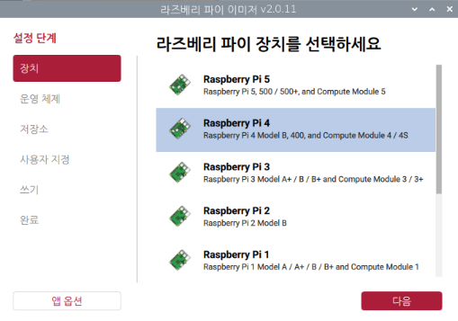

**③ 운영 체제** → 목록 맨 아래 **사용자 정의 이미지 사용(Use custom)** → 복사한 이미지 파일 선택

- 인터넷으로 받을 때는 `Raspberry Pi OS (other)`에 들어가서 `Raspberry Pi OS Full (64-bit)`을 고릅니다. (맨 위 기본 항목이 아님!)

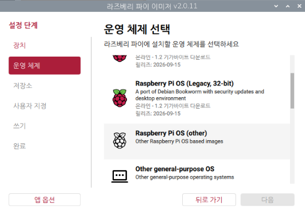

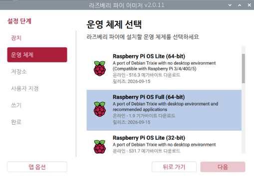

**④ 저장소** → 내 SD카드 선택 (USB 메모리 등 다른 저장장치를 고르지 않도록 주의!)

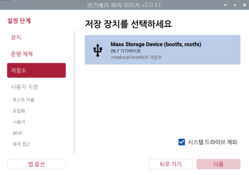

**⑤ 사용자 지정** (6개 화면)

| 화면 | 입력 |
|---|---|
| 호스트 이름 | `raspberrypi` (기본값 그대로) |
| 지역화 | 수도 도시에 `Seoul` 검색 → **Seoul (South Korea)** 선택 → 시간대 `Asia/Seoul`, 키보드 `kr`이 자동으로 채워짐 |
| 사용자 이름 | `pi` / 비밀번호 `11111111` (1을 8개, 두 번 입력) |
| Wi‑Fi | SSID `SWAI_5G` / 비밀번호 `swai2024` (두 번 입력, 대소문자 정확히) |
| SSH 인증 | 켜지 않음 (그대로 다음) |
| 라즈베리 파이 커넥트 | 켜지 않음 (그대로 다음) |

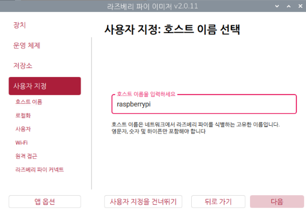

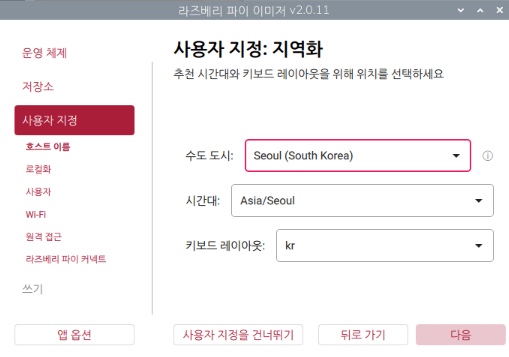

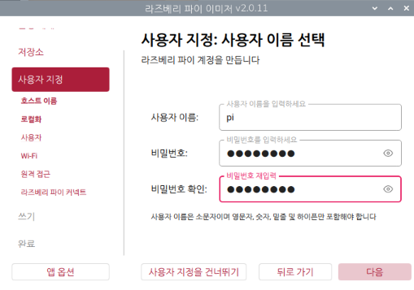

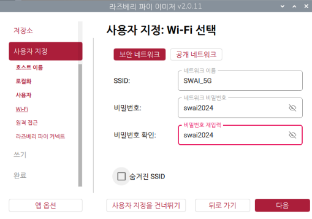

> ⚠️ Wi‑Fi 화면에는 **지금 PC가 연결된 Wi‑Fi 이름**이 미리 채워져 있을 수 있습니다. 지우고 `SWAI_5G`를 입력하세요.
> 💡 비밀번호가 8자보다 짧으면 "비밀번호가 너무 짧습니다(최소 8자)"가 뜹니다.

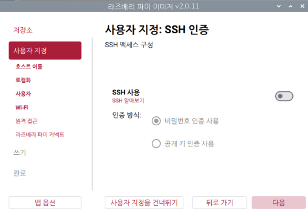

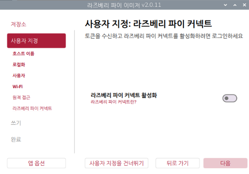

**⑥ 쓰기** → 요약을 확인하고 **기록** 클릭 → 완료되면 SD카드를 빼서 라즈베리파이에 꽂습니다.

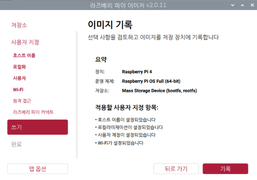

> ⚠️ 기록하면 SD카드의 기존 내용이 **모두 지워집니다**.
> 🔒 `11111111`은 연수용 비밀번호입니다. 학교 수업에서 쓸 때는 바꾸세요 (터미널에서 `passwd`).

### 참고 영상: OS 설치 (Imager 2.0 기준, 2025년 11월)
- [How to Install Raspberry Pi OS Using Raspberry Pi Imager 2.0](https://www.youtube.com/watch?v=RV0saVGXQ5k) — Gadgets Pod, 초보자용 단계별 설명 (영어)
- [Raspberry Pi Imager 2.0: Set Up Your Raspberry Pi in Minutes](https://www.youtube.com/watch?v=MepM1juFYzA) — Gary Explains (영어)

> 💡 Imager는 2025년 10월 **2.0**으로 크게 바뀌었습니다. 그 전 영상(1.x)은 화면이 달라서 헷갈릴 수 있으니 날짜를 확인하세요.

---

## 2. 라즈베리파이 소개 (굽는 동안)

### 피지컬 컴퓨팅이란?
- 컴퓨터가 **센서로 세상을 느끼고**(입력), **LED·소리·모터로 반응**하는(출력) 것
- 화면 속 코딩 → **손에 잡히는 결과**로 이어져 학생 흥미가 높습니다.

```
 [센서: 온도·기울기·버튼] → [라즈베리파이: 프로그램] → [LED·화면·소리]
        입력                        처리                     출력
```

### 공식 홈페이지
- **https://www.raspberrypi.com** — 라즈베리파이 회사: 제품, 운영체제 다운로드, 설명서
- **https://www.raspberrypi.org** — 라즈베리파이 재단: 교사용 수업 자료, 교사 연수, 코드 클럽

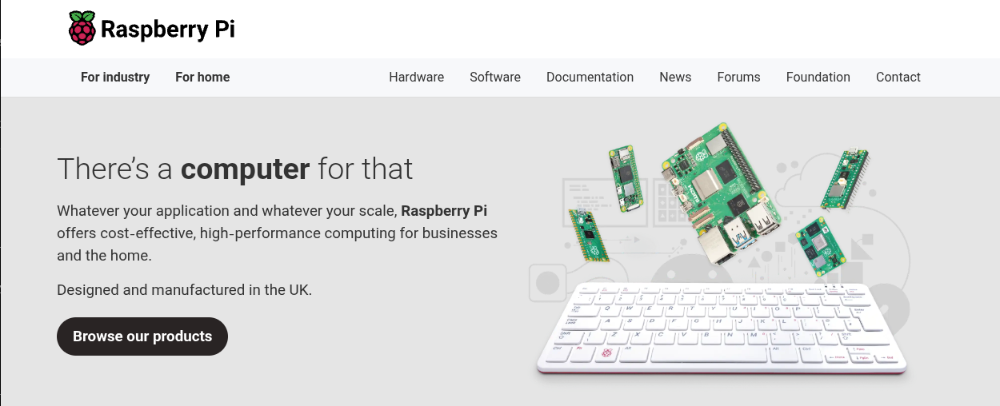

- 영국에서는 초등학생부터 라즈베리파이로 컴퓨팅을 배웁니다. 재단은 수업 자료와 교사 연수를 **무료**로 제공합니다.

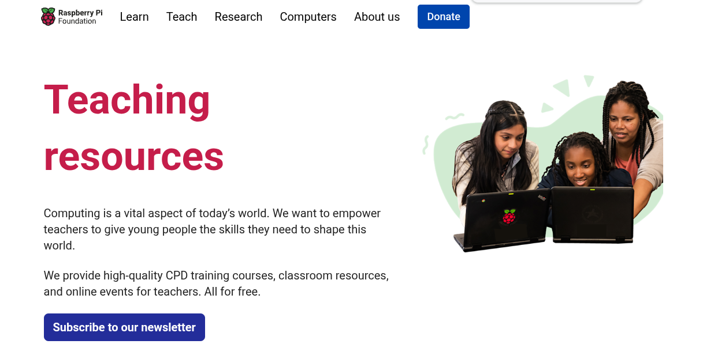

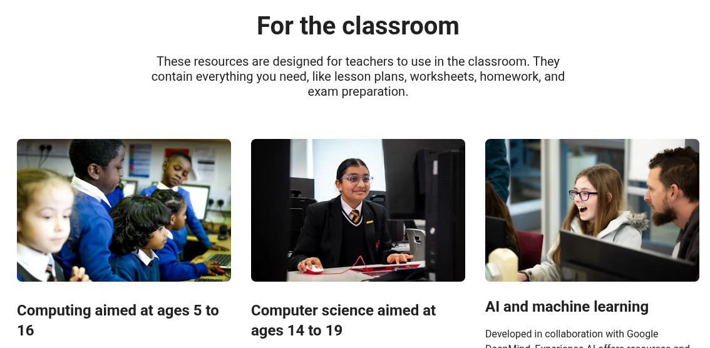

### 라즈베리파이의 역사
- 영국 케임브리지 대학의 에벤 업튼(Eben Upton) 등이 "학생들이 **싸고 쉽게 프로그래밍을 배울 컴퓨터**"를 만들기로 하고, 2009년 **라즈베리파이 재단**(자선단체)을 세움

| 연도 | 사건 |
|---|---|
| 2012 | **Raspberry Pi 1** 출시 (35달러) |
| 2015 | Raspberry Pi 2, 5달러짜리 **Pi Zero** / 우주정거장(ISS)에 **Astro Pi**(SenseHAT 장착)가 올라감 |
| 2016 | Raspberry Pi 3 (Wi‑Fi·블루투스 내장) |
| 2019 | **Raspberry Pi 4** (오늘 쓰는 보드) |
| 2021 | Raspberry Pi Pico (마이크로컨트롤러) |
| 2023 | Raspberry Pi 5 |

- 지금까지 전 세계에서 **수천만 대**가 팔린, 교육용 컴퓨터의 대표

### Raspberry Pi 4B 제원
- 신용카드만 한 **완전한 컴퓨터** (리눅스 운영체제, 인터넷, 문서 작업 가능)

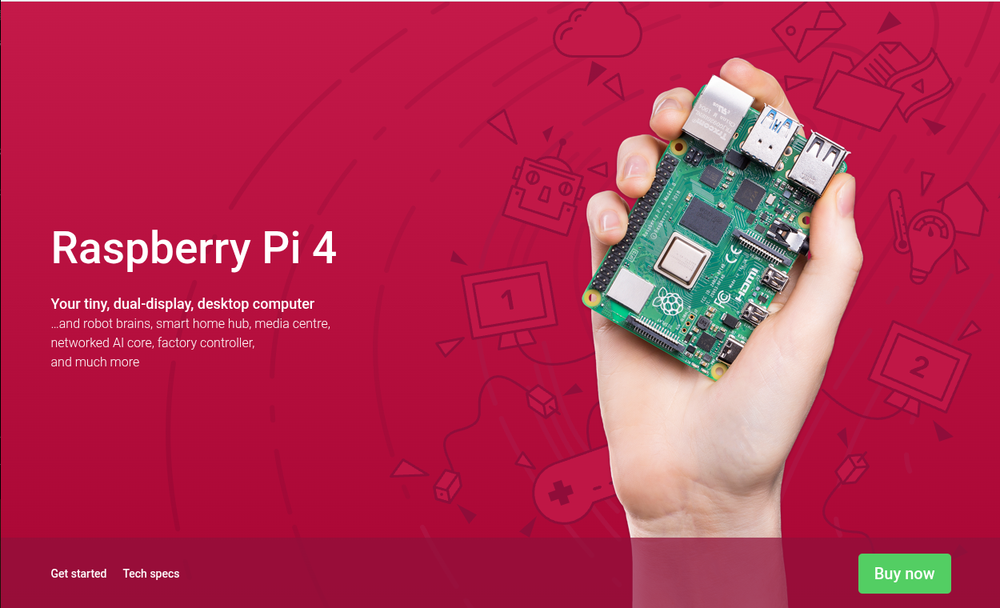

| 항목 | 내용 |
|---|---|
| CPU | 4코어 ARM Cortex‑A72, 64비트, 1.8GHz (2019년 초기 보드는 1.5GHz) |
| 메모리 | **8GB** (1·2·4GB 모델도 있음) |
| 무선 | Wi‑Fi (2.4GHz·5GHz), 블루투스 5.0 |
| 유선 | 기가비트 이더넷 |
| USB | USB 3.0 × 2, USB 2.0 × 2 |
| 화면 | micro‑HDMI × 2 (4K 지원). Argon One V2 케이스에서는 **일반 HDMI**로 바뀜 |
| 저장 | microSD 카드 (운영체제가 여기에 설치됨) |
| 전원 | USB‑C, 5V 3A |
| **GPIO** | **40핀**: 센서나 확장보드(HAT)를 연결하는 핀 → 오늘 SenseHAT을 꽂는 곳 |

### 가격: 35달러 컴퓨터가 비싸진 이유
- 출시 때 Pi 4 가격 (세금·배송비 제외, 미국 달러)

| 메모리 | 출시 가격 | 2026년 4월 이후 |
|---|---|---|
| 1GB | 35달러 (2019년 6월) | 35달러 (그대로) |
| 4GB | 55달러 (2019년 6월) | **100달러** |
| 8GB | 75달러 (2020년 5월) | **165달러** |

- 2025년 12월 · 2026년 2월 · 2026년 4월, 세 번에 걸쳐 값이 올랐습니다.
- 이유: **AI 데이터센터**가 고성능 메모리를 대량으로 쓰면서 메모리 공장이 그쪽 생산에 몰렸고, 라즈베리파이가 쓰는 LPDDR4 메모리 값이 1년 사이 **약 7배** 올랐습니다. (라즈베리파이 공식 발표, 2026년 4월)
- 그래서 메모리가 큰 모델일수록 많이 올랐고, 1GB 모델은 그대로입니다. 재단은 메모리 값이 내려가면 가격을 되돌리겠다고 밝혔습니다.
- 수업 이야깃거리: "AI가 발전하면 왜 작은 컴퓨터 값이 오를까?" → 반도체 수요와 공급

### 소개 영상
- [What is a Raspberry Pi?](https://www.youtube.com/watch?v=uXUjwk2-qx4) — 라즈베리파이 공식 채널 (영어)
- [What is a Raspberry Pi 4](https://www.youtube.com/watch?v=5Oz78pxED80) — 라즈베리파이 공식 채널 (영어)
- [라즈베리 파이 소개 및 설치 방법](https://www.youtube.com/watch?v=rFtrC11zcsc) — 다두이노 채널 (한국어)

### Argon One V2 케이스
- 알루미늄 케이스 + 냉각 팬
- 포트가 **뒤쪽으로 모여 있음** (HDMI 2개는 일반 HDMI 크기)
- 위쪽 **자석 덮개**를 열면 GPIO 핀이 나옴 → 여기에 SenseHAT 장착
- 전원 버튼: 한 번 누르면 켜짐, 길게 누르면 꺼짐

---

## 3. SenseHAT 소개

> 원래 국제우주정거장(ISS) 교육 프로젝트 **Astro Pi**용으로 만든 확장보드입니다.

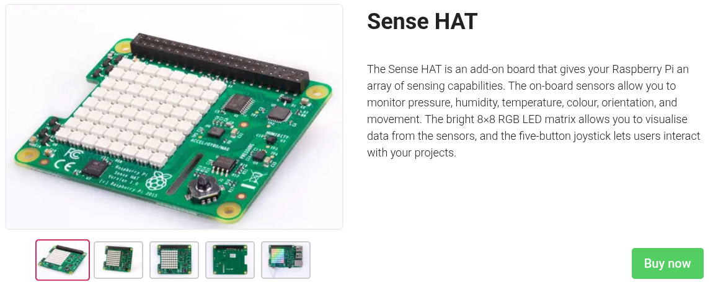

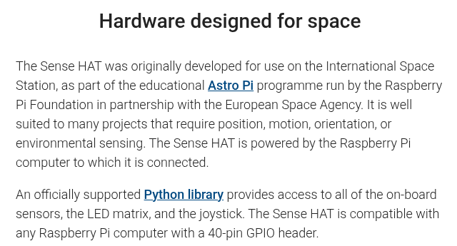

| 부품 | 하는 일 |
|---|---|
| 8×8 RGB LED | 64개 점을 원하는 색으로 켬 → 글자·그림 표시 |
| 조이스틱 | 위·아래·왼쪽·오른쪽·누르기 (5방향 버튼) |
| 온도·습도 센서 | 주변 온도(℃), 습도(%) |
| 기압 센서 | 기압(hPa) |
| 움직임 센서 | 기울기, 흔들림, 방향(나침반) |
| 컬러 센서 (V2만) | 앞에 댄 물체의 색(빨강·초록·파랑 양) |

### LED 좌표
```
     x →  0 1 2 3 4 5 6 7
  y  0    ● · · · · · · ·   ← (0, 0)은 왼쪽 위
  ↓  1    · · · · · · · ·
     …
     7    · · · · · · · ●   ← (7, 7)은 오른쪽 아래
```

---

## 4. 첫 부팅과 한글 환경 설정

1. SD카드를 꽂고 전원 연결 → SenseHAT에 **무지개 LED가 잠깐 켜지면** 정상
2. 바탕화면이 나오면 Wi‑Fi 연결 확인 (오른쪽 위 아이콘)
3. 터미널을 열고(검은 화면 아이콘) 아래 명령을 **한 줄씩** 입력합니다.

```bash
sudo apt update
sudo apt install -y fonts-nanum fcitx5-hangul
```

| 명령 | 뜻 |
|---|---|
| `sudo apt update` | 설치할 프로그램 목록을 최신으로 받기 (관리자 권한) |
| `sudo apt install -y fonts-nanum fcitx5-hangul` | 나눔 글꼴 + 한글 입력기 설치 (`-y`: 자동으로 "예") |

> 💡 `fcitx5-hangul`만 설치하면 입력기 본체(`fcitx5`)와 설정 도구가 함께 설치되고, 재부팅하면 입력기가 자동으로 켜집니다. 단, **한글은 아래 7번처럼 직접 추가**해야 합니다.
> 비밀번호를 물으면 `11111111` 입력 (입력해도 화면에 안 보이는 것이 정상)

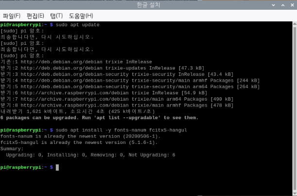

- `[sudo] pi 암호:` → 비밀번호를 입력하고 Enter
- 비밀번호가 틀리면 `죄송합니다만, 다시 시도하십시오.`가 나옵니다. 다시 입력하면 됩니다.
- 위 그림은 이미 설치된 기기에서 찍어서 `already the newest version`(이미 최신 버전)이라고 나옵니다. 처음 설치할 때는 내려받기·설치 과정이 여러 줄 지나갑니다.

4. **화면 언어를 한국어로** 바꾸기
   - Imager에서 Seoul을 골라도 **시간대와 키보드만** 바뀌고, 메뉴·화면은 **영어**로 나옵니다.
   - 라즈베리 메뉴 → **Preferences** → **Control Centre** → 왼쪽 **Localisation** → **Set Locale...**
   - Language `ko (Korean)`, Country `KR (South Korea)`, Character Set `UTF-8` → **OK** → **Close**

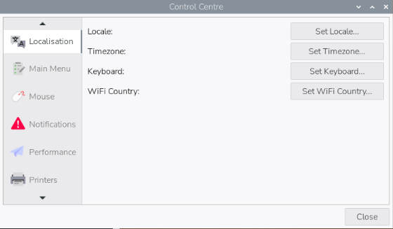

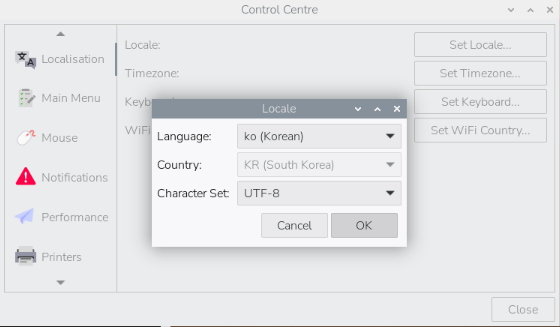

5. 터미널에서 재부팅합니다. 켜지면 메뉴가 한국어로 나옵니다.

```bash
sudo reboot
```

> 💡 글꼴을 먼저 설치하고(3번) 언어를 바꿔야(4번) 한글 메뉴가 깨지지 않습니다.

6. 재부팅 후 오른쪽 위에 **키보드 아이콘**이 보이는지 확인
7. **입력기에 한글 추가** (꼭 해야 함)
   - 키보드 아이콘 **오른쪽 클릭** → **설정** → **Fcitx 구성** 창이 열림
   - 오른쪽 **사용가능한 입력기**의 **입력기 검색** 칸에 `한글` 입력 → **한글** 선택 → 가운데 **◀** 버튼으로 왼쪽 **현재 입력기** 목록에 추가
   - **적용** 클릭
   - 아래 그림처럼 왼쪽 **현재 입력기**에 `키보드 - 영어 (미국)`과 `한글`이 있으면 완료

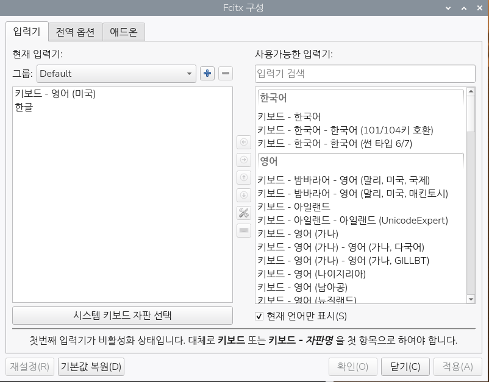

8. **한/영 키**(또는 `Ctrl + Space`)로 한글 입력을 확인합니다.

> ⏱ 시간이 부족하면 강사가 준비한 **예비 SD카드**(한글 설정 완료본)로 바꿔 끼웁니다.

> 🎬 **한글 환경 설정 영상에 대해**: 2026년 9월 현재, 최신 OS(Trixie)와 fcitx5 기준의 한국어 영상은 찾기 어렵습니다. 검색되는 영상 대부분은 2017~2022년 영상으로, 예전 입력기(ibus, fcitx 4)와 예전 명령을 씁니다. **이 교재의 캡처 순서를 따르는 것이 가장 정확합니다.**

---

## 5. 첫 코드 (5분)

메뉴 → 프로그래밍 → **Thonny**를 열고 입력 → **Run(▶)**

```python
from sense_hat import SenseHat
sense = SenseHat()
sense.set_rotation(180)
sense.clear()
sense.show_message("Hello")
```
- `set_rotation(180)`: Argon 케이스에서는 SenseHAT이 **거꾸로** 꽂히므로 화면을 180도 돌립니다.
- `clear()`: 화면을 지우고 시작합니다.

LED에 `Hello`가 흘러가면 1차시 완료! 🎉

> 💡 `show_message`는 **영문·숫자만** 표시합니다. 한글을 넣으면 깨져 보입니다.

**Scratch로는?** 메뉴 → 프로그래밍 → **Scratch 3** → 왼쪽 아래 **확장 기능 추가** → `Raspberry Pi Sense HAT`

```scratchblocks
when green flag clicked
set rotation to (180 v) degrees :: extension
clear display :: extension
display text [Hello] :: extension
```
